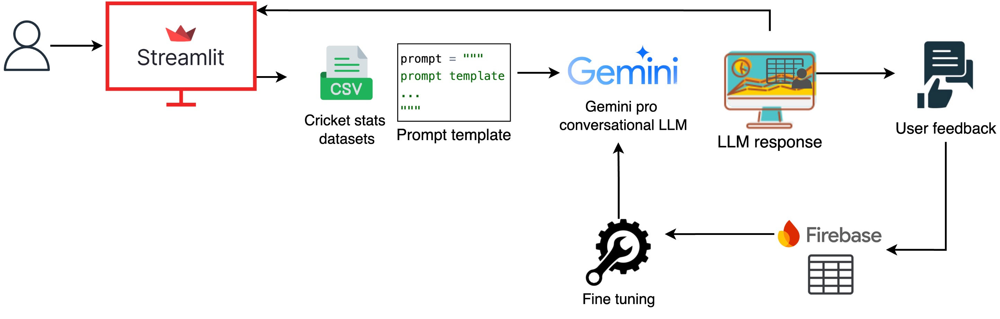

# Cricket Statistics LLM Chatbot

This project leverages a Large Language Model (LLM) to serve as an expert cricket statistics analyst. The chatbot processes natural language prompts from users and converts them into efficient Python code using Pandas. The code is designed to interact with a comprehensive cricket match dataset stored in a CSV file, enabling data filtering, aggregation, and manipulation based on user requests.

## Key Features

- **Natural Language Processing:** The chatbot understands user prompts related to cricket statistics and generates accurate, executable Pandas code.
- **Comprehensive Cricket Analysis:** Supports a wide range of cricket statistics queries, such as player performance, bowling economy, match-specific data, and more.
- **Optimized for Large Datasets:** The project includes strategies to handle large CSV files efficiently.
- **Interactive Feedback System:** Users can provide feedback on the generated code using thumbs up or thumbs down buttons, helping improve the model's performance.
- **Database Integration:** Feedback is stored in an SQLite database for future analysis and improvements.
- **Interactive and User-Friendly:** Provides quick and reliable insights into cricket data, making it an essential tool for cricket analysts and enthusiasts.

## Technologies Used

- **Python:** Core language used for coding.
- **Pandas:** Utilized for data manipulation and analysis.
- **Google Gemini Pro LLM:** Converts natural language questions into Pandas code.
- **Streamlit:** For building an interactive user interface.
- **SQLite:** Stores feedback data to help improve code generation.

## System Design


## Getting Started

To get started with the project, follow these steps:

1. **Clone the repository:**
    ```bash
    git clone https://github.com/your-username/cricket-statistics-llm-chatbot.git
    cd cricket-statistics-llm-chatbot
    ```

2. **Create and activate a virtual environment:**
    ```bash
    conda create -p venv python=3.11.9 -y
    conda activate ./venv
    ```

3. **Install the required dependencies:**
    ```bash
    pip install -r requirements.txt
    ```

4. **Set up the database:**
    ```bash
    python sql.py
    ```

5. **Run the Streamlit app:**
    ```bash
    streamlit run app.py
    ```

6. **Interacting with the Chatbot:**
    - Input your cricket statistics query in natural language, and the chatbot will generate the corresponding Pandas code and display the results.
    - Provide feedback on the generated code by clicking the thumbs up or thumbs down button.

7. **Reset the Session:**
    - If you want to reset the session and input a new query, simply click the "Reset" button.

## Contributing

Contributions are welcome! Please open an issue or submit a pull request with your suggestions and improvements.
