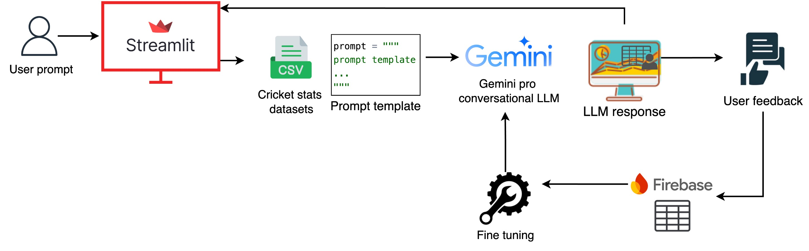

# Project Documentation

## 1. Choice of Gemini Pro LLM and Fine-tuning

The choice of **Gemini Pro LLM** was driven by its proficiency in handling sophisticated NLP tasks, including the generation of Python code. For this project, We fine-tuned the model to enhance its performance in generating domain-specific Pandas code for cricket data analysis. Fine-tuning enabled the model to better understand cricket-related terminology and the structure of the data, reducing the errors in code generation and ensuring more accurate, context-aware outputs.

## 2. Prompt Engineering Techniques

- **Prompt Length**: The prompt includes dataset definitions, attribute explanations, and task context to ensure the model has a clear understanding of the data. While the current prompt is long, it ensures completeness, though it can be optimized by dynamically including only relevant dataset attributes.
- **Context Length Handling**: The model’s context length limits are addressed by truncating unnecessary details and using programmatic approaches to manage context size effectively.
- **In-context Learning & Few-shot Examples**: Including a few-shot approach ensures the model understands how to generate accurate Pandas code by referencing prior examples, significantly improving its performance for specific tasks.

## 3. Fine-tuning Strategy

Fine-tuning was done to tailor the model's performance for cricket analytics.The fine-tuning technique used is **supervised fine-tuning**. In supervised fine-tuning, we provide the model with a dataset of labeled examples. These examples consist of inputs and their corresponding desired outputs. The model is then trained to minimize the difference between its predictions and the desired outputs.

This technique is useful for tasks where we have a lot of labeled data and we want the model to learn a specific mapping from inputs to outputs. Please find google's fine-tuning guide [here](https://ai.google.dev/gemini-api/docs/model-tuning/tutorial?lang=python)

## 4. System Design

## 5. Future enhancements

- Implementing Retrieval-Augmented Generation (RAG), potentially with FAISS, to dynamically select relevant data tables. This approach:
  - Significantly reduces the prompt size.
  - Eliminates the need to define all datasets within the prompt template, focusing only on the necessary data.
- Calculate accuracy - Figure out a standard way of evaluating the LLM.
    - Benchmark once trained - [link](https://crfm.stanford.edu/helm/classic/latest/#/)
- Conversation history
- Handling complex analysis.
- Handling input token limits that api could process - Human readable messages or suggest users to cut down the input text if the input exceeds limits.
